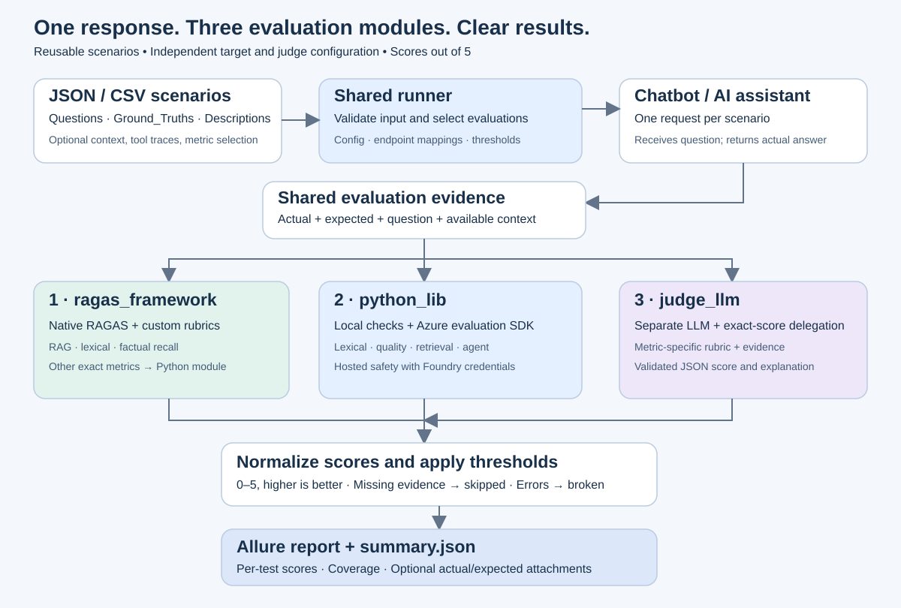

# Reusable AI evaluation framework

Run JSON or CSV scenarios against a chatbot/AI assistant HTTP endpoint, evaluate the actual answers with three interchangeable modules, and publish scores **out of 5** in **Allure**.

| Module | Purpose | Guide |
|---|---|---|
| `ragas_framework` | Native RAGAS metrics for RAG quality | [RAGAS README](src/ai_eval/ragas_framework/README.md) |
| `python_lib` | Local deterministic checks and Microsoft Azure AI Evaluation Python SDK | [Python library README](src/ai_eval/python_lib/README.md) |
| `judge_llm` | Independent model judging responses against evidence and rubrics | [Judge LLM README](src/ai_eval/judge_llm/README.md) |



## New users: inputs and module diagrams

Start with [what to fill in, field by field](docs/new-user-setup.md). It includes a copyable starter configuration, required scenario columns, endpoint request/response mappings, each module's credentials, optional evaluation evidence, and the run commands.

| Module | Standalone SVG |
|---|---|
| RAGAS | [RAGAS framework flow](docs/diagrams/ragas-framework.svg) |
| Python library | [Python library flow](docs/diagrams/python-library.svg) |
| Judge LLM | [Judge LLM flow](docs/diagrams/judge-llm.svg) |

The [overall SVG](docs/evaluation-flow.svg) shows how the modules work together. Each module README also embeds its own diagram.

## Run every evaluator

The [full-catalog run guide](docs/full-catalog-run.md) runs all 32 evaluator types across all three modules using a real local RAG workflow. It includes lexical, semantic, completeness, safety, grounding, retrieval, tool, task and attack-pair evaluations. Native Azure availability appears in a separate suite. The F1/coherence profiles are smoke tests only.

## Sample chatbot sources and how to run each module

The sample endpoints are hosted locally from upstream open-source implementations. They are not publicly hosted chatbot API URLs.

| Sample chatbot | Source | Local endpoints |
|---|---|---|
| NLTK ELIZA, rule-based | [Upstream ELIZA](https://www.nltk.org/api/nltk.chat.eliza.html); [our HTTP adapter](examples/eliza_chatbot.py) | Port `8766`: `/chat` or `/v1/chat/completions` |
| Qwen2.5-0.5B-Instruct through Ollama, real model | [Qwen model](https://huggingface.co/Qwen/Qwen2.5-0.5B-Instruct); [Ollama API](https://docs.ollama.com/api/chat) | Smoke-test port `11435`: target `/api/chat`, judge `/v1/chat/completions` |

Both samples were run successfully as described in the [verification record](docs/verification.md). The older `mock_chatbot.py` quick start below is a separate fixed-answer fixture.

Each module guide now includes its source links, setup, selected unit tests, ELIZA evaluation, real Ollama integration and Allure generation/viewing commands:

- [RAGAS tests and reports](src/ai_eval/ragas_framework/README.md#run-this-modules-tests-and-allure-reports)
- [Python library tests and reports](src/ai_eval/python_lib/README.md#run-this-modules-tests-and-allure-reports)
- [Judge LLM tests and reports](src/ai_eval/judge_llm/README.md#run-this-modules-tests-and-allure-reports)

Ready-to-run single-module profiles live in [examples/modules](examples/modules). For all three modules together, use the [endpoint test guide](docs/open-source-endpoint-tests.md). Unit tests print terminal results; endpoint scenario runs produce `allure-results/` and `summary.json`.

## Quick start: no cloud account required

The core and demo run on Python 3.9+. Use Python 3.10+ for optional evaluation SDKs (Python 3.11 recommended for a shared environment).

```sh
python3 -m venv .venv
source .venv/bin/activate
python -m pip install -e .
python examples/mock_chatbot.py
```

In another terminal:

```sh
source .venv/bin/activate
ai-eval --data examples/scenarios.json --config examples/local.json --output reports/demo
# CSV is supported too; choose a fresh directory for each run.
ai-eval --data examples/scenarios.csv --config examples/local.json --output reports/demo-csv
```

The demo returns fixed fixture answers. Its scores validate the pipeline, not the quality of a real model. To run without installing the package, prefix `python3 -m ai_eval.cli` with `PYTHONPATH=src` in place of `ai-eval`.

## Allure reports

The runner writes Allure 2 result JSON directly: no pytest process is needed for scenario evaluation. Install the Allure command-line application separately using the [official installation instructions](https://allurereport.org/docs/install/), then:

```sh
allure serve reports/demo/allure-results
# Or create a static report:
allure generate reports/demo/allure-results -o reports/demo/html --clean
```

Each scenario/backend/metric is a test. Reports show the score, threshold, description, and status. Set `attach_evidence: true` to attach actual/expected answers, context, and native evaluator results; this intentionally stores dataset and model content on disk. It is disabled by default. `summary.json` provides machine-readable results and coverage counts.

## Input contract

Required columns, case-insensitive: **Questions**, **Ground_Truths**, **Descriptions**. Singular `question`, `ground_truth`, `description` also work. All three must contain nonempty text. JSON is a nonempty array; CSV must have a header. IDs must be unique, or row numbers are assigned.

```json
[
  {
    "id": "returns-policy",
    "Questions": "How long do I have to return an item?",
    "Ground_Truths": "You can return it within 30 days.",
    "Descriptions": "Verify the published returns window.",
    "contexts": ["Returns are accepted within 30 days of purchase."],
    "metrics": ["groundedness", "relevance", "response_completeness"]
  }
]
```

Optional fields:

| Field | Use |
|---|---|
| `metrics` | Per-scenario metric list; overrides config defaults |
| `contexts` | Retrieved passages, array of strings |
| `retrieved_documents`, `retrieval_ground_truth` | Ranked documents and relevance labels for document retrieval |
| `tool_calls`, `tool_definitions` | Agent tool traces and schemas |
| `instructions` | Task constraints for task adherence |
| `conversation` | Source conversation for personal-attribute grounding |
| `protected_reference` | Reference text for the judge's protected-material heuristic |
| `rubric`, `labels`, `passing_labels` | Custom criteria and valid/passing labels for model scorer/labeler |
| `baseline_safety_score`, `attack_safety_score` | Paired normalized safety results for direct-attack comparison |
| `sdk_inputs` | Per-metric SDK keyword overrides for advanced input schemas |

For CSV, array/object fields use JSON inside a quoted CSV cell, with embedded quotes doubled. Prefer JSON for agent scenarios. Contexts supplied in the dataset must represent what the chatbot actually retrieved; configure endpoint evidence extraction to obtain live passages when available.

## Connect a real chatbot

Copy an example configuration and set its environment variables. `${VARIABLE}` placeholders are expanded; missing variables fail before execution. `.env` files are not loaded automatically.

```json
{
  "target": {
    "url": "${CHATBOT_URL}",
    "headers": {"Authorization": "Bearer ${CHATBOT_TOKEN}"},
    "body": {"tenant": "evaluation"},
    "question_field": "question",
    "response_path": "data.answer",
    "evidence_paths": {"contexts": "data.passages", "tool_calls": "data.tool_calls"},
    "timeout": 60
  },
  "backends": ["python_lib", "ragas_framework", "judge_llm"],
  "metrics": ["relevance", "groundedness", "similarity"],
  "threshold": 3,
  "thresholds": {"groundedness": 4},
  "fail_on_skip": false,
  "attach_evidence": false
}
```

Add the backend configuration sections from the module examples. The target receives the question and configured static body; expected answers and descriptions are never sent to it. Each scenario produces exactly one chatbot request and shares that response across selected evaluators. List indexes work in response paths, for example `choices.0.message.content`.

The target supports synchronous JSON POST (`protocol: "json"`), chat completions (`protocol: "chat_completions"`), and Ollama chat (`protocol: "ollama"`). Chat protocols append a user message to configured static messages and disable streaming. Session negotiation and polling APIs require a custom adapter. The judge endpoint uses a chat-completions-shaped request and is configured separately from the chatbot under test. Target calls have a timeout and are not automatically retried because assistant requests can change state.

## Scores and applicability

- Native 0–1 metrics: multiply by 5. Native SDK 1–5 quality scores: retain the original value.
- Native risk severity 0–7: `5 × (1 − severity / 7)`. Boolean risk detected: 0; absent: 5. Boolean groundedness: true is 5.
- Composite content safety: lowest normalized component score. Document retrieval: NDCG@3 by default; full native output is available with attachments.
- Judge scores: 0–5 directly. Every scored metric uses **higher = better** and passes at `score >= threshold`.
- Unsupported backend metrics or missing evidence are **skipped**, not given a fabricated score. Invalid scores, missing packages, credentials, malformed responses, or service failures are **errors** (Allure `broken`).
- Mean score excludes skips/errors and is only a convenience summary; metrics and backends are not interchangeable measurements. Check individual results and coverage.

Exit codes: `0` success, `1` failed/error results, all-skipped runs, or skips when `fail_on_skip=true`; `2` input/configuration errors. Output directories must be empty to prevent mixing runs.

## Evaluator coverage

The catalog tracks the evaluator names in the requested [Microsoft built-in evaluator reference](https://learn.microsoft.com/en-us/azure/foundry-classic/concepts/built-in-evaluators). The three engines have different native capabilities. [The coverage matrix](docs/evaluator-coverage.md) identifies native SDK support, RAGAS mappings, judge approximations, and explicit shared-computation routes. RAGAS and a generic LLM judge do not reproduce every specialized Microsoft service.

## Reuse and extension

```python
from ai_eval.core import load_cases
from ai_eval.runner import run

# Purpose: execute a configured suite from an existing Python application.
def evaluate_assistant(config):
    return run(load_cases("examples/scenarios.json"), config, "reports/application-run")
```

Add a metric to `catalog.py`, define evidence requirements, and implement `evaluate(metric, case)` in the appropriate backend. Backends return `(score_out_of_5, raw_result)` or raise `NotApplicable`. Register additional backend classes in `runner.BACKENDS`. The runner is synchronous; call it from a worker thread when integrating into an asynchronous app.

Every explicit function/method has a purpose comment before its definition (or decorators).

## Verification

```sh
PYTHONPATH=src python3 -m unittest discover -s tests -v
```

Unit tests cover shared contracts, real local libraries, native RAGAS lexical metrics and mocked cloud boundaries. Separate scripts exercise ELIZA and a real Qwen model over HTTP using common data. Live Azure hosted evaluator calls still require your project credentials. RAGAS is pinned to its documented 0.3.2 API; the Azure SDK is constrained to major version 1. Validate upgrades against your configured service and output schema.

## Open-source chatbot and shared test data

Use [data/common_scenarios.json](data/common_scenarios.json) or its equivalent [CSV](data/common_scenarios.csv) across all three modules. Each contains `Questions`, `Ground_Truths`, and `Descriptions`. The new [open-source endpoint guide](docs/open-source-endpoint-tests.md) runs the actual NLTK ELIZA algorithm over HTTP and describes an Ollama LLM setup. See [verification results](docs/verification.md).

The three module READMEs each include every catalog evaluator with its native, rubric or delegated route. Regenerate their tables with `PYTHONPATH=src python3 scripts/update_coverage.py` after extending the catalog.
