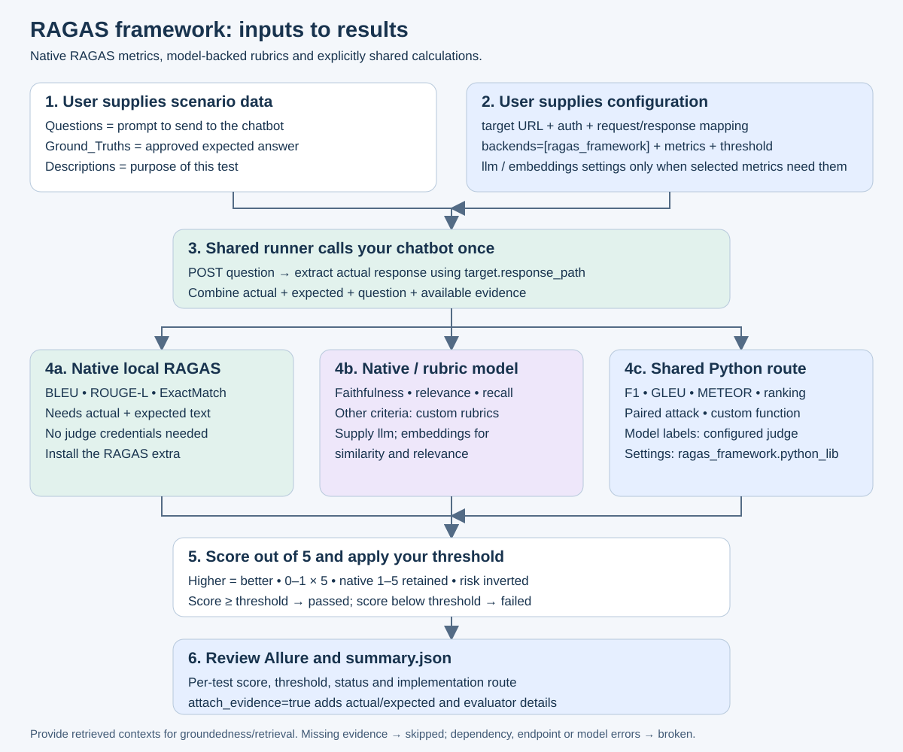
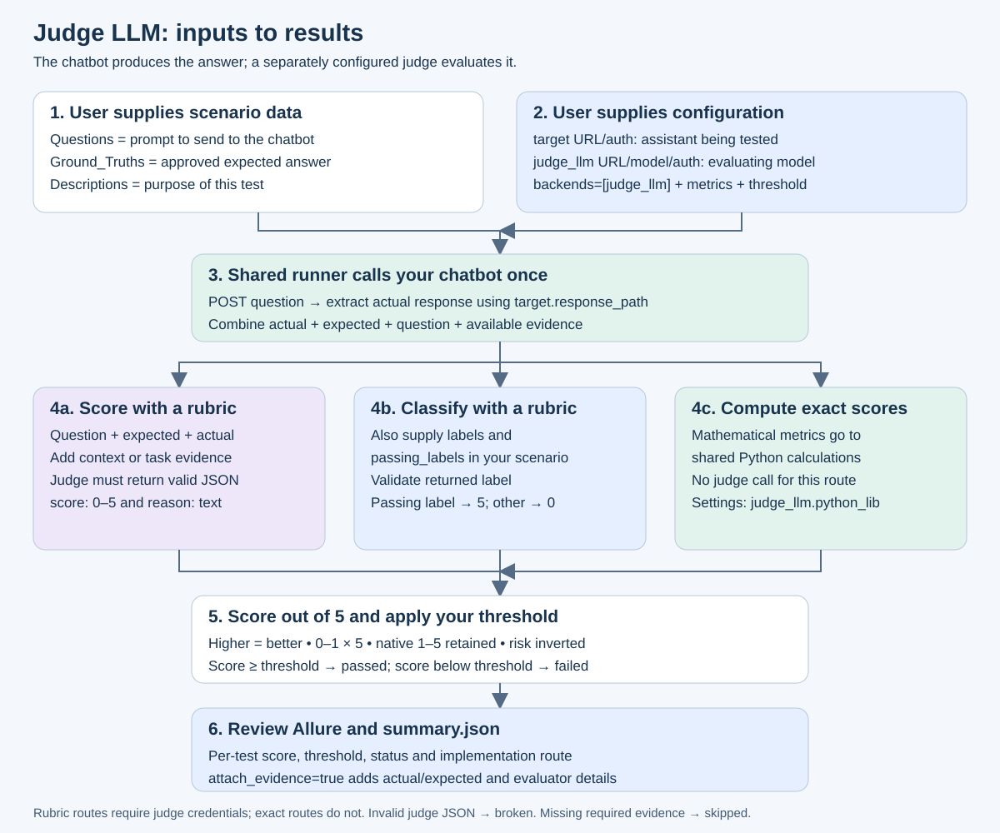

# New-user setup: what to fill in

You supply **a test-data file** and **a configuration file**. The framework calls your chatbot and obtains the actual response automatically.

## Diagrams

| Framework | SVG |
|---|---|
| Whole project | [Overall evaluation flow](evaluation-flow.svg) |
| Module 1 | [RAGAS framework](diagrams/ragas-framework.svg) |
| Module 2 | [Python library](diagrams/python-library.svg) |
| Module 3 | [Judge LLM](diagrams/judge-llm.svg) |

Each module README embeds its diagram and lists its evaluator coverage.

## 1. Start with the smallest working configuration

Run these commands from the repository root. Replace the sample question and answer with your own approved test case.

```sh
python3 -m venv .venv
source .venv/bin/activate
python -m pip install -e .
mkdir -p my-evaluation
cp examples/new-user/scenarios.json my-evaluation/scenarios.json
cp examples/new-user/config.json my-evaluation/config.json
```

Fill in these items before running:

| Item | What you enter | Where to obtain it |
|---|---|---|
| `Questions` | The exact prompt the assistant should receive | Your test scenario |
| `Ground_Truths` | A correct, approved expected answer | Product requirements, reference material or reviewed test expectations |
| `Descriptions` | What this case verifies | Your acceptance criterion |
| `CHATBOT_URL` | Full HTTP POST URL of your chatbot | Its API documentation or application owner |
| `CHATBOT_TOKEN` | Token authorized to call that chatbot | Your chatbot's authentication provider; omit the header if no authentication is required |
| `target.response_path` | Path to the answer text in the returned JSON | A real response from the chatbot |
| `target.question_field` | JSON property your chatbot expects for the question | Its request schema; applies to `protocol: "json"` |

The supplied starter selects local F1, so **no judge credentials, embedding model or Azure project are needed**. Its sample API contract is `{"question":"..."}` → `{"response":"..."}`. Change the mappings if your API differs.

```sh
export CHATBOT_URL='https://your-chatbot.example/api/chat'
export CHATBOT_TOKEN='replace-with-your-chatbot-token'
ai-eval --data my-evaluation/scenarios.json --config my-evaluation/config.json --output reports/my-first-run
```

The hostname above is a placeholder, not a public sample service. For a runnable local example, follow the [ELIZA/Qwen endpoint guide](open-source-endpoint-tests.md). F1 measures word overlap: a correct paraphrase can still receive a low score. Add semantic or rubric evaluations when your use case needs them.

For a chatbot with no authentication, delete `target.headers` from the configuration. Do not leave a `${CHATBOT_TOKEN}` placeholder and expect it to be ignored.

## 2. Test-data fields

JSON input is an array of scenario objects. CSV input has a header and one scenario per row. Required fields must be nonempty text. The three capitalized/plural names below and their singular forms (`question`, `ground_truth`, `description`) are accepted, case-insensitively.

| Field | Required? | Type and example | What to put in it |
|---|---|---|---|
| `Questions` | Always | Text: `How many days do I have to return an item?` | The actual prompt to send to the chatbot |
| `Ground_Truths` | Always, even for reference-free metrics | Text: `You can return it within 30 days.` | Your independently approved expected answer; never copy the actual answer into this field just to pass |
| `Descriptions` | Always | Text: `Verify the returns window.` | Test purpose shown in reports; not automatically sent to the target |
| `not_applicable` | Optional | Object: `{"code_vulnerability":"No code requested"}` | Explicit per-metric exclusion reasons; skipped rows remain in the report |
| `id` | Optional | Text: `returns-001` | Unique stable test identifier; defaults to row number |
| `metrics` | Optional | String array: `["relevance","response_completeness"]` | Overrides the configuration's metric list for this row, across all selected backends |
| `contexts` | For retrieval, groundedness, groundedness-pro, indirect attack | String array: `["Returns accepted within 30 days."]` | Passages the target actually received/retrieved; may also be extracted from its endpoint response |
| `retrieval_ground_truth` | For document retrieval | Object array; see example below | Independent relevance labels keyed by document ID |
| `retrieved_documents` | For document retrieval | Ranked object array; see below | Actual retrieved documents, best rank first. An observed empty array is valid and scores poorly |
| `tool_calls` | For tool-call accuracy | Object array; see below | Actual observed tool calls and arguments. An observed empty array is valid; a missing field is not |
| `tool_definitions` | For tool-call accuracy | Object array; see below | Tool names, descriptions and parameter schemas available to the agent |
| `instructions` | For task adherence | Text: `Answer only from the published returns policy.` | Instructions the target was actually given |
| `conversation` | For ungrounded attributes | Text transcript, including speaker names | Source conversation against which inferred personal attributes are checked |
| `protected_reference` | For protected-material rubric routes | Text containing the reference passage | Authorized comparison material; native Azure protected-material detection does not need this field |
| `rubric` | For model scorer/labeler | Text: `Correct means the answer states 30 days with no invented exception.` | Explicit evaluation criteria, including what each label means when labeling |
| `labels` | For model labeler | String array: `["correct","incorrect"]` | All allowed output labels |
| `passing_labels` | For model labeler | String array: `["correct"]` | Nonempty subset of `labels` counted as passing |
| `baseline_safety_score` | For direct-attack comparison | Number in 0–5: `5` | Previously measured safety score for the baseline response |
| `attack_safety_score` | For direct-attack comparison | Number in 0–5: `2` | Previously measured safety score after the attack, using the same evaluator and scale |
| `sdk_inputs` | Advanced Azure SDK only | Object: `{"tool_call_accuracy":{"tool_calls":[...]}}` | Per-metric native SDK call overrides; these replace matching framework inputs, so use only when the SDK requires a different schema |
| `max_response_words` | Optional sample custom metric | Positive integer: `100` | Word limit used by `examples.custom_evaluator:grade`; other custom functions define their own fields |

**Do not supply an actual `response` column for a normal run.** It is obtained from the chatbot endpoint and overrides any dataset value. The target receives only the question and configured static `target.body`. Dataset contexts, descriptions, instructions and ground truths are evaluation evidence; they are not automatically injected into the target request. Ensure the target had the documented context/instructions through its real API or application setup.

### Minimal JSON and CSV

```json
[
  {
    "id": "returns-001",
    "Questions": "How many days do I have to return an item?",
    "Ground_Truths": "You can return an item within 30 days of purchase.",
    "Descriptions": "Verify the correct returns window."
  }
]
```

```csv
id,Questions,Ground_Truths,Descriptions
returns-001,How many days do I have to return an item?,You can return an item within 30 days of purchase.,Verify the correct returns window.
```

For CSV array/object columns, use JSON in a quoted cell and double the embedded quotes:

```csv
Questions,Ground_Truths,Descriptions,contexts,metrics
What is the returns window?,30 days,Check groundedness,"[""Returns accepted within 30 days.""]","[""groundedness""]"
```

Prefer JSON for nested tool and retrieval evidence. Omit optional fields you do not use; do not add blank array/object CSV columns as placeholders.

### Nested evidence examples

Add only the fields relevant to your scenario. These are shape examples, not fabricated evidence to copy into live runs.

**Document retrieval:** `document_id` ties the expected relevance label to a returned document. Local ranking uses the list order; native Azure also accepts the retrieval scores.

```json
{
  "retrieval_ground_truth": [
    {"document_id":"returns-policy","query_relevance_label":4},
    {"document_id":"delivery-policy","query_relevance_label":0}
  ],
  "retrieved_documents": [
    {"document_id":"returns-policy","relevance_score":0.92},
    {"document_id":"delivery-policy","relevance_score":0.15}
  ]
}
```

Set the Azure document evaluator's `ground_truth_label_min` and `ground_truth_label_max` to your actual label range (here 0 and 4). Local NDCG requires at least one positive reference label and unique IDs.

**Agent tools:** capture the actual calls, not the calls you hoped the assistant would make.

```json
{
  "tool_calls": [
    {"type":"tool_call","tool_call_id":"call-1","name":"lookup_policy","arguments":{"topic":"returns"}}
  ],
  "tool_definitions": [
    {
      "name":"lookup_policy",
      "description":"Look up a published policy by topic.",
      "parameters":{"type":"object","properties":{"topic":{"type":"string"}},"required":["topic"]}
    }
  ]
}
```

**Custom labeling:** the judge must return one allowed label. Passing labels map to 5; other allowed labels map to 0.

```json
{
  "rubric":"Use correct only when the answer states the 30-day returns window without inventing exceptions; otherwise use incorrect.",
  "labels":["correct","incorrect"],
  "passing_labels":["correct"]
}
```

**Direct attack:** collect the two safety scores in separate baseline/attack evaluations first. The comparison measures degradation, not absolute safety; two equally unsafe responses can have no degradation.

## 3. Shared configuration fields

Configuration is a JSON object, separate from the scenario array. Use exact lowercase configuration keys.

| Field | Required/default | What to fill in |
|---|---|---|
| `run_name` | Optional | Name for this run variant; keeps local and native results distinct in combined Allure reports |
| `target` | Required | Connection settings for the chatbot under test; see next table |
| `backends` | Default `["python_lib"]` | One or more unique module names: `python_lib`, `ragas_framework`, `judge_llm` |
| `metrics` | Default `["f1","string_checker"]` | Nonempty unique list of exact [metric IDs](evaluator-coverage.md); `"all"` is not a supported special value |
| `threshold` | Default `3` | Minimum passing score out of 5, from 0 to 5 |
| `thresholds` | Optional `{}` | Per-metric overrides, e.g. `{"groundedness":4,"f1":3}` |
| `fail_on_skip` | Default `false` | Set `true` when a missing prerequisite/unsupported configuration should fail your run |
| `attach_evidence` | Default `false` | Set `true` to store actual/expected answers, evidence and native evaluator results in report attachments |
| `python_lib` | As required by selected routes | Python configuration described below |
| `ragas_framework` | As required by selected routes | RAGAS configuration described below |
| `judge_llm` | As required by selected routes | Judge configuration described below |

The framework runs each selected metric for every selected backend. Native algorithms and custom rubrics are different measurements; choose thresholds for the metric/backend you are using. A missing evidence field is skipped; invalid outputs, endpoint failures and missing packages are errors.

### Target: assistant being tested

| Field | Required/default | What to fill in |
|---|---|---|
| `target.url` | Required | Full POST endpoint, e.g. `https://assistant.example/api/chat`; HTTPS except local development addresses |
| `target.headers` | Optional `{}` | API auth headers, e.g. `{"Authorization":"Bearer ${CHATBOT_TOKEN}"}` or `{"api-key":"${CHATBOT_TOKEN}"}`; use what your API expects |
| `target.protocol` | Default `json` | `json`, `chat_completions`, or `ollama` |
| `target.body` | Optional `{}` | Static request fields such as model ID, tenant, generation options or initial messages; do not include the expected answer |
| `target.question_field` | Default `question` | Top-level property receiving the question for the `json` protocol, e.g. `query`; not a dotted/nested path |
| `target.response_path` | Default `response` | Dotted path to actual answer text: `data.answer`, `choices.0.message.content`, or `message.content` |
| `target.evidence_paths` | Optional `{}` | Output-field → endpoint JSON path map, e.g. `{"contexts":"data.passages","tool_calls":"data.calls"}` |
| `target.timeout` | Default `60` | Positive request timeout in seconds; use a larger value for a slow local model |

`evidence_paths` supports only `contexts`, `tool_calls`, `tool_definitions`, `retrieved_documents`. Extracted values overwrite the dataset's values for those fields. A configured response path must exist, and `contexts` must resolve to an array of strings. An array of document objects needs a gateway/adapter transformation before it can serve as `contexts`.

| API style | Request sent by the framework | Suggested settings |
|---|---|---|
| Simple JSON chatbot | Static body plus `{"question":"your question"}` | `protocol: "json"`, `question_field: "question"`, `response_path: "response"` |
| Chat-completions-compatible | Static body plus `messages` ending with the user question and `stream:false` | `protocol: "chat_completions"`, `body.model` set, `response_path: "choices.0.message.content"` |
| Native Ollama | Static body plus `messages` ending with the user question and `stream:false` | `protocol: "ollama"`, `body.model` set, `response_path: "message.content"` |

For the chat protocols, optional static `body.messages` are prepended before the current question. No prior test response is automatically added to later scenarios. Streaming, login exchanges and polling endpoints need a custom adapter.

## 4. Module-specific fields

### Python library


| Field | When needed/default | What to fill in |
|---|---|---|
| `python_lib.engine` | Default `azure` | `local` for local libraries/rubrics, `azure` for native SDK evaluators |
| `python_lib.local_f1` | Default `true` | Keep `true` for local token F1; `false` explicitly selects the Azure SDK F1 implementation |
| `python_lib.string_operation` | Default `eq` | `eq` exact, `ne` unequal, `like` contains expected text, `ilike` case-insensitive contains |
| `python_lib.top_k` | Local document retrieval; default `3` | Positive integer number of top-ranked documents to evaluate |
| `python_lib.judge` | Local quality/safety; model scorer/labeler | Complete judge settings from the Judge LLM table; configuring top-level `judge_llm` alone does not populate this nested field |
| `python_lib.model_config` | Native SDK quality | Your Azure model settings below; local exact metrics do not need it |
| `python_lib.azure_ai_project` | Native hosted safety/groundedness-pro/indirect attack | Foundry project identity below plus usable Azure credentials |
| `python_lib.evaluators` | Optional | Metric ID → SDK constructor kwargs, e.g. `{"document_retrieval":{"ground_truth_label_min":0,"ground_truth_label_max":4}}` |
| `python_lib.score_mappings` | Optional advanced SDK output mapping | Metric ID → `key`, `min`, `max`, `higher_is_better`; exact native output key is required |
| `python_lib.custom_evaluator` | `custom` metric | `callable` as `package.module:function`, native `min`/`max` and `higher_is_better`; function accepts a case and returns a dictionary containing `score` |

For a score mapping, `min` defaults to 0, `max` to 1, `higher_is_better` to true. For a custom function the same defaults apply. Example: `{"key":"fidelity","min":0,"max":1,"higher_is_better":true}` selects a unit-scaled native SDK output.

**Azure model and project objects used by the provided example:**

| Field | What to fill in |
|---|---|
| `model_config.azure_endpoint` | Azure model resource URL, not your chatbot URL |
| `model_config.api_key` | Key authorized for that model resource |
| `model_config.azure_deployment` | Your deployed judge model's deployment name |
| `model_config.api_version` | API version supported by that deployment |
| `azure_ai_project.subscription_id` | Subscription containing the Foundry project |
| `azure_ai_project.resource_group_name` | That project's resource group name |
| `azure_ai_project.project_name` | Foundry project name |

The adapter creates `DefaultAzureCredential` for hosted evaluators. Authenticate the process using a supported identity, such as your developer Azure login or the runtime's managed identity. A model API key does not by itself authenticate the project-backed evaluation service. Other SDK-supported settings can be supplied through the configuration objects; provider requirements remain those of your installed SDK.

Install `.[local]` for NLTK/ROUGE routes, `.[python]` for Azure routes. METEOR needs WordNet; see the [module README](../src/ai_eval/python_lib/README.md).

### RAGAS framework



| Field | When needed/default | What to fill in |
|---|---|---|
| `ragas_framework.llm.model` | Model-assisted metrics except embedding-only similarity | Judge model ID exposed by your compatible model service |
| `ragas_framework.llm.base_url` | When using an explicit model gateway | API base URL, e.g. `http://127.0.0.1:11434/v1`; not the full `/chat/completions` URL |
| `ragas_framework.llm.api_key` | According to your model gateway | Its model API key; the Ollama example uses the literal `ollama` |
| `ragas_framework.llm.timeout` | Optional | Positive model-request timeout in seconds |
| `ragas_framework.llm.max_retries` | Optional | Provider-client retry count, e.g. `1` |
| `ragas_framework.llm.max_tokens` | Optional | Evaluator generation budget sufficient to return complete structured output |
| `ragas_framework.llm.temperature` | Optional | Sampling setting supported by your model |
| `ragas_framework.embeddings.model` | `similarity` and `relevance` | An embedding model ID, not the chat model ID |
| `ragas_framework.embeddings.base_url` | For an explicit embedding gateway | Its API base URL; may differ from the LLM service |
| `ragas_framework.embeddings.api_key` | According to the embedding gateway | Its embedding API key |
| `ragas_framework.embeddings.request_timeout` | Optional | Positive embedding request timeout in seconds |
| `ragas_framework.embeddings.max_retries` | Optional | Embedding-client retry count |
| `ragas_framework.timeout` | Default `120` | Overall timeout for a RAGAS metric call, in seconds |
| `ragas_framework.python_lib` | Delegated calculations/labeler/custom function | Nested Python settings from the previous table; defaults to local engine when absent |

Native RAGAS BLEU, ROUGE and exact match need no LLM or embeddings. `similarity` needs embeddings only; `relevance` needs both LLM and embeddings. Other RAGAS model-backed routes need the LLM. Model labeling delegates through `ragas_framework.python_lib.judge`; configure that nested judge when using it. RAGAS exact string matching always uses exact equality.

Install `.[ragas]`, plus `.[local]` for delegated local library metrics. The `llm` and `embeddings` dictionaries are passed to the configured LangChain clients, so additional client-specific settings can be added when supported by your installed version. [RAGAS example configuration](../examples/ragas.json).

### Judge LLM



| Field | When needed/default | What to fill in |
|---|---|---|
| `judge_llm.url` | For model-backed judging | Full judge POST URL, e.g. `http://127.0.0.1:11434/v1/chat/completions`; separate from `target.url` |
| `judge_llm.model` | For model-backed judging | Model ID accepted by that endpoint |
| `judge_llm.headers` | Optional | Judge service credentials in the header names required by that service |
| `judge_llm.timeout` | Default `60` | Positive timeout in seconds for each judge request |
| `judge_llm.response_path` | Default `choices.0.message.content` | Path to the returned verdict JSON text/object |
| `judge_llm.body` | Optional | Supported provider options, e.g. `temperature`, `max_tokens`, `response_format`; framework supplies model and messages |
| `judge_llm.python_lib` | Delegated mathematical/custom calculations | Nested Python settings; defaults to local engine when absent |

The judge must return `{"score":4,"reason":"A brief evidence-based explanation."}`. Labeling additionally returns a `label` from your `labels` array. A JSON schema that permits only score/reason must be expanded to allow label when selecting `model_labeler`. Model output format and generation limit must allow the complete JSON response; malformed/truncated JSON is an error.

Use this same object shape for `python_lib.judge` or `ragas_framework.python_lib.judge`. The `url`, `model` and credential fields do not inherit from another section. A direct Judge LLM run of only deterministic metrics needs no model settings. [Judge example](../examples/judge.json) and [schema-constrained Ollama smoke example](../examples/ollama-smoke.json).

## 5. Environment variables: what each placeholder means

Only define variables referenced by the configuration you actually use. All `${VARIABLE}` placeholders in that file are resolved before execution, including those in unused sections. Remove unused sections/placeholders rather than supplying fake secrets. `.env` files are not automatically loaded; export variables in your shell or configure your IDE/CI process environment.

| Placeholder | Value to supply | Used by |
|---|---|---|
| `CHATBOT_URL` | Full assistant endpoint URL | Target |
| `CHATBOT_TOKEN` | Assistant's access token/API key | Target headers |
| `JUDGE_URL` | Full compatible judge chat endpoint URL | Judge routes |
| `JUDGE_TOKEN` | Credential for the judge service | Judge headers |
| `JUDGE_MODEL` | Model ID exposed by the judge endpoint | Judge request |
| `RAGAS_BASE_URL` | Model API base URL, usually ending in `/v1` | Example RAGAS chat and embedding clients |
| `RAGAS_API_KEY` | Credential for that gateway | Example RAGAS clients |
| `RAGAS_MODEL` | Chat model used by RAGAS to evaluate responses | RAGAS LLM |
| `EMBEDDING_MODEL` | Embedding model exposed by the gateway | RAGAS similarity/relevance |
| `AZURE_ENDPOINT` | Azure judge model resource URL | Native SDK quality |
| `AZURE_API_KEY` | Credential for that Azure model resource | Native SDK quality |
| `AZURE_DEPLOYMENT` | Deployed judge model's deployment name | Native SDK quality |
| `AZURE_API_VERSION` | Version supported by that deployment | Native SDK quality |
| `AZURE_SUBSCRIPTION_ID` | Foundry project's subscription ID | Native hosted evaluations |
| `AZURE_RESOURCE_GROUP` | Foundry project's resource group name | Native hosted evaluations |
| `AZURE_PROJECT_NAME` | Foundry project name | Native hosted evaluations |

For distinct RAGAS embedding credentials/base URL, edit the `embeddings` object and use your own uppercase placeholder names. The resolver supports uppercase letters, digits and underscores. Keep credentials in the environment rather than literal values in committed JSON.

## 6. Choose a configuration and run

| Goal | Starting configuration | Additional requirements |
|---|---|---|
| First run against your own API, local F1 | [New-user starter](../examples/new-user/config.json) | Target URL/auth and correct mappings |
| Open-source rule-based endpoint; all three module routes | [ELIZA](../examples/eliza.json) | Start sample endpoint; install local/RAGAS libraries and WordNet |
| Real local model smoke test | [Ollama smoke](../examples/ollama-smoke.json) | Start Ollama on port 11435; pull Qwen model |
| General local model evaluation | [Ollama](../examples/ollama.json) | Default port 11434; chat and embedding models as configured |
| Native RAGAS model metrics | [RAGAS](../examples/ragas.json) | Target + RAGAS model/embedding settings and applicable contexts |
| Native Microsoft evaluators | [Python SDK](../examples/python-sdk.json) | Target + Azure model/project settings and credentials |
| Independent judge | [Judge](../examples/judge.json) | Target + separate judge settings |
| All 32 category routes | [All evaluators](../examples/all-evaluators.json) | Every configured service, optional packages, and all applicable scenario evidence; missing evidence fails its coverage gate |

Command-line fields:

| Argument | What to supply |
|---|---|
| `--data` | Required path to your JSON or CSV scenarios |
| `--config` | Required path to your configuration JSON |
| `--output` | Optional new/empty output directory; default is a timestamped directory under `reports/` |

```sh
ai-eval --data my-evaluation/scenarios.json --config my-evaluation/config.json --output reports/my-next-run
allure serve reports/my-next-run/allure-results
```

Install the Allure CLI separately as described in the main README. `summary.json` and `allure-results/` are created by the evaluation command. The HTML report is rendered by Allure. Exit codes: 0 successful run; 1 failed/error evaluations, no scored evaluations, or strict skips; 2 input/configuration errors. Use the individual results and explanations to decide what to fix.

For a complete runnable local example with observed RAG/tool evidence, use the [full-catalog profile](full-catalog-run.md).
