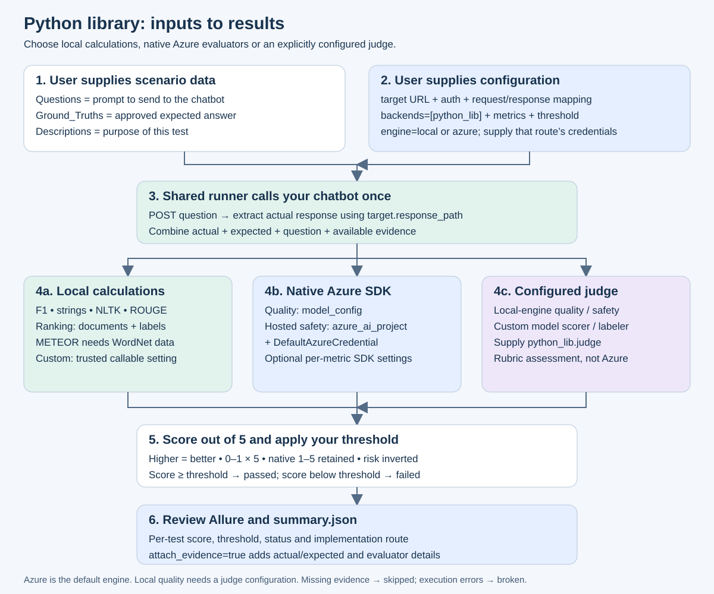

# Module 2: Python library evaluation

## Framework diagram and required inputs



[Open standalone SVG](../../../docs/diagrams/python-library.svg) · [New-user setup and every input field](../../../docs/new-user-setup.md)

Fill `target`, `metrics`, and `threshold`. Set `python_lib.engine` to `local` or `azure`. Local exact metrics need no model credentials. Native Azure quality needs `model_config`; hosted safety needs `azure_ai_project` and an authenticated identity. Local rubric routes need `python_lib.judge`.

Every scenario must contain **Questions**, **Ground_Truths**, and **Descriptions**. The framework obtains the actual answer from your endpoint. Copy the [starter scenario](../../../examples/new-user/scenarios.json) and follow the linked guide for field types, sample values, credentials and optional evidence.

Choose native Azure AI Evaluation SDK calls or local Python libraries. The runner obtains the actual answer from the chatbot once, then evaluates it against the shared scenario.

```sh
python -m pip install -e '.[local]'
# For the native Microsoft evaluators:
python -m pip install -e '.[python]'
ai-eval --data data/common_scenarios.json --config examples/python-sdk.json --output reports/python-sdk
```

## Local and hosted engines

`python_lib.engine` defaults to `azure`. Quality evaluators use `model_config`; safety evaluators use `azure_ai_project` and `DefaultAzureCredential`. See [examples/python-sdk.json](../../../examples/python-sdk.json) for environment variables. `evaluators[metric]` supplies SDK constructor kwargs; scenario `sdk_inputs[metric]` supplies advanced native inputs.

Set `engine: "local"` for NLTK BLEU/GLEU/METEOR, rouge-score ROUGE-L F1, and local document ranking. METEOR requires WordNet:

```sh
python -m nltk.downloader -d .venv/nltk_data wordnet
export NLTK_DATA="$PWD/.venv/nltk_data"
```

Local F1 uses casefolded Unicode word tokens and multiset overlap. Set `local_f1: false` to use the SDK's tokenizer in Azure mode. Local BLEU uses uniform 1–4-gram weights and NLTK smoothing method 1. Local document retrieval reports linear-gain NDCG@k, precision/recall@k and unlabeled-document holes; its NDCG is the normalized score. `top_k` defaults to 3, and input list order defines rank. This is not the SDK's full composite retrieval implementation.

`string_checker` supports `eq`, `ne`, `like`, `ilike` via `string_operation`. Local `text_similarity` uses character sequence similarity and is not semantic similarity. These are local alternatives to the grader categories, not Azure grader-service requests.

For local quality/safety rubrics and custom model labeler/scorer, configure `python_lib.judge` using the same schema as `judge_llm`. Delegation is recorded explicitly. For exact native Microsoft detection, select `engine: "azure"` with the required project and model credentials.

## Scores and extension

All scores are out of 5 with higher meaning better. SDK 1–5 quality scores are retained; unit scores are multiplied by 5; severity scores are inverted; composite safety uses its worst component. SDK document retrieval defaults to `ndcg@3`. Override a native output with `score_mappings[metric]`, for example `{"key":"fidelity","min":0,"max":1,"higher_is_better":true}`. Unknown keys/scales become errors.

`direct_attack` accepts paired `baseline_safety_score` and `attack_safety_score`, each already normalized out of 5 by the same safety evaluator. It reports `5 − max(0, baseline − attacked)`. This measures degradation only: two equally unsafe responses have zero degradation, so also inspect absolute safety scores.

`custom` runs a trusted configured callable, never code from the dataset:

```json
{"python_lib":{"custom_evaluator":{"callable":"my_package.evaluators:grade","min":0,"max":1,"higher_is_better":true}}}
```

The callable accepts a case dictionary and returns `{"score":0.8,"reason":"..."}`. Add its package to the environment. NLTK, Azure SDK and cloud services are optional; missing dependencies are execution errors rather than fabricated scores.

## Full evaluator run

The [full-catalog guide](../../../docs/full-catalog-run.md) runs every metric with actual local retrieval/tool evidence and separately lists native Azure availability. The ELIZA and Ollama module profiles below are focused integration tests, not complete catalog runs.

## Run this module's tests and Allure reports

All commands below run **from the repository root**, not from this module directory. The module-specific configurations select only `python_lib`. They reuse the same [common JSON](../../../data/common_scenarios.json) or [CSV](../../../data/common_scenarios.csv) data.

### Sample chatbot sources and endpoint addresses

| Sample | Upstream implementation/model | Endpoint used here |
|---|---|---|
| ELIZA | [NLTK ELIZA](https://www.nltk.org/api/nltk.chat.eliza.html), exposed by our [HTTP adapter](../../../examples/eliza_chatbot.py) | `http://127.0.0.1:8766/v1/chat/completions` (also supports `/chat`) |
| Qwen via Ollama | [Qwen2.5-0.5B-Instruct](https://huggingface.co/Qwen/Qwen2.5-0.5B-Instruct), hosted locally with [Ollama](https://docs.ollama.com/api/chat) | Target: `http://127.0.0.1:11435/api/chat`; judge: `http://127.0.0.1:11435/v1/chat/completions` |

These are local services you start, not public chatbot URLs copied from a website. ELIZA generates responses through its upstream rule-based implementation; Qwen generates responses using actual open model weights. Both were exercised in the [verification runs](../../../docs/verification.md). The older `mock_chatbot.py` is only a fixed-answer fixture and is not the open-source chatbot integration.

### A. Install and run the module's unit/library tests

```sh
python3 -m venv .venv
source .venv/bin/activate
python -m pip install -e '.[local]'
python -m nltk.downloader -d .venv/nltk_data wordnet
export NLTK_DATA="$PWD/.venv/nltk_data"
export RAGAS_DO_NOT_TRACK=true
PYTHONPATH=src:tests python -m unittest \
  test_extended.ExtendedTests.test_local_libraries \
  test_extended.ExtendedTests.test_document_ranking \
  test_extended.ExtendedTests.test_custom_callable \
  test_framework.FrameworkTests.test_sdk_adapter -v
```

These tests report to the terminal. The scenario runs below create Allure results. To run all shared tests, use `PYTHONPATH=src python -m unittest discover -s tests -v`; install `.[local,ragas]` to execute all optional library tests without skips. Native Azure use additionally requires `.[python]` and your service credentials.

### B. Run this module against ELIZA

Terminal 1, from the repository root:

```sh
source .venv/bin/activate
python examples/eliza_chatbot.py --port 8766
```

Terminal 2, also from the repository root:

```sh
source .venv/bin/activate
export NLTK_DATA="$PWD/.venv/nltk_data"
export RAGAS_DO_NOT_TRACK=true
ai-eval --data data/common_scenarios.json --config examples/modules/python_lib-eliza.json --output reports/python_lib-eliza
```

This runs 5 scenarios × 6 metrics = **30 evaluations for this module**. ELIZA cannot answer the factual geography question, so its quality failures and CLI exit code 1 are expected. Do not treat those scores as execution errors. The report is still generated. Use `.csv` instead of `.json` for the common CSV file and choose a different output directory.

The ELIZA profile exercises exact calculations; it does not use ELIZA as an LLM judge. For model-backed evaluations, use the next profile.

### C. Run this module's real LLM integration test

Install Ollama using its official instructions. Terminal 1:

```sh
OLLAMA_HOST=127.0.0.1:11435 ollama serve
```

Terminal 2, from the repository root:

```sh
source .venv/bin/activate
export RAGAS_DO_NOT_TRACK=true
OLLAMA_HOST=127.0.0.1:11435 ollama pull qwen2.5:0.5b
PYTHONPATH=src python scripts/run_llm_tests.py --config examples/modules/python_lib-ollama.json --data data/common_scenarios.json --output reports/python_lib-ollama
```

This runs 5 scenarios × 2 metrics = **10 evaluations for this module**. F1 is computed locally; coherence delegates to the configured Python-module judge. This sample does not call the native Azure evaluators.

The integration script exits successfully when the requests and scoring contracts work, even if quality scores fail. It raises an error for execution errors or skips. The small model and ELIZA-oriented expected phrases make this a connectivity/contract test, not a production quality benchmark. Stop servers with Ctrl+C when finished.

### D. Generate and view Allure

Install **Allure 2 CLI and Java** using the [Allure installation guide](https://allurereport.org/docs/install/). For an npm installation, `npm install --global allure-commandline@2` makes `allure` available on your PATH. The framework writes Allure result files directly; `allure-pytest` is not needed for these scenario commands.

View results directly in a temporary report:

```sh
allure serve reports/python_lib-eliza/allure-results
```

Generate a persistent HTML report and open it through Allure's local server:

```sh
allure generate reports/python_lib-eliza/allure-results -o reports/python_lib-eliza/html --clean
allure open reports/python_lib-eliza/html
```

For the real model run:

```sh
allure generate reports/python_lib-ollama/allure-results -o reports/python_lib-ollama/html --clean
allure open reports/python_lib-ollama/html
```

Artifacts are `summary.json`, `allure-results/`, and (after generation) `html/` under the chosen run directory. Each test shows the score out of 5, threshold, status and implementation. These profiles enable attachments containing actual/expected responses and evaluator details. Serve HTML with `allure open`; directly opening `index.html` can prevent report data from loading.

Use a **fresh evaluation output directory** on every rerun. Allure's `--clean` only rebuilds its HTML directory; it does not make an existing evaluation output directory reusable.

<!-- COVERAGE START -->
## Evaluators covered from Microsoft

Reference: [evaluator section](https://learn.microsoft.com/en-us/azure/foundry-classic/concepts/evaluation-evaluators/) and [built-in catalog](https://learn.microsoft.com/en-us/azure/foundry-classic/concepts/built-in-evaluators), reviewed 2026-09-15. The section URL has no readable index; the catalog and its linked category pages define this list. Direct/indirect attacks and custom evaluators come from the linked pages.

Every listed category has an execution route. Native algorithms, custom rubrics, and explicit delegation are distinguished below. A rubric is not an equivalent implementation of a specialized Microsoft detector. Required credentials and evidence still apply.


| Metric ID | Execution in this module | Additional evidence |
|---|---|---|
| `coherence` | CoherenceEvaluator | Base question / actual / expected |
| `fluency` | FluencyEvaluator | Base question / actual / expected |
| `similarity` | SimilarityEvaluator | Base question / actual / expected |
| `f1` | Local token F1 / F1ScoreEvaluator | Base question / actual / expected |
| `bleu` | BleuScoreEvaluator / local library alternative | Base question / actual / expected |
| `gleu` | GleuScoreEvaluator / local library alternative | Base question / actual / expected |
| `rouge` | RougeScoreEvaluator / local library alternative | Base question / actual / expected |
| `meteor` | MeteorScoreEvaluator / local library alternative | Base question / actual / expected |
| `retrieval` | RetrievalEvaluator | contexts |
| `document_retrieval` | DocumentRetrievalEvaluator / local library alternative | retrieval_ground_truth, retrieved_documents |
| `groundedness` | GroundednessEvaluator | contexts |
| `groundedness_pro` | GroundednessProEvaluator | contexts |
| `relevance` | RelevanceEvaluator | Base question / actual / expected |
| `response_completeness` | ResponseCompletenessEvaluator | Base question / actual / expected |
| `hate_unfairness` | HateUnfairnessEvaluator | Base question / actual / expected |
| `sexual` | SexualEvaluator | Base question / actual / expected |
| `violence` | ViolenceEvaluator | Base question / actual / expected |
| `self_harm` | SelfHarmEvaluator | Base question / actual / expected |
| `content_safety` | ContentSafetyEvaluator | Base question / actual / expected |
| `protected_material` | ProtectedMaterialEvaluator | protected_reference |
| `code_vulnerability` | CodeVulnerabilityEvaluator | Base question / actual / expected |
| `ungrounded_attributes` | UngroundedAttributesEvaluator | conversation |
| `intent_resolution` | IntentResolutionEvaluator | Base question / actual / expected |
| `task_adherence` | TaskAdherenceEvaluator | instructions |
| `tool_call_accuracy` | ToolCallAccuracyEvaluator | tool_calls, tool_definitions |
| `model_labeler` | Configured judge delegation | rubric, labels, passing_labels |
| `string_checker` | Local computation | Base question / actual / expected |
| `text_similarity` | Local computation | Base question / actual / expected |
| `indirect_attack` | IndirectAttackEvaluator | contexts |
| `direct_attack` | Local computation | baseline_safety_score, attack_safety_score |
| `custom` | Local computation | Base question / actual / expected |
| `model_scorer` | Configured judge delegation | rubric |

With `python_lib.engine=local`, model-assisted Python evaluations use `python_lib.judge`; they are reported as delegated rubrics. Azure protected-material detection does not require a reference; local judge approximations do. Empty retrieved-document/tool-call arrays are valid observed outcomes; missing fields are skipped.

The direct-attack metric compares independently obtained baseline and attacked safety scores; it does not generate attacks. Custom Python functions come from trusted configuration. Azure grader-service APIs are not invoked: corresponding grader categories use local or judge implementations.

Common data: [JSON](../../../data/common_scenarios.json) / [CSV](../../../data/common_scenarios.csv). Run the [open-source endpoint tests](../../../docs/open-source-endpoint-tests.md).
<!-- COVERAGE END -->
